# Career Passport — Yanagida


**Career Passport** is a web-based alumni job placement platform built for Blue Knight University. It allows **verified alumni** to showcase their academic credentials, apply to exclusive job listings, and track their applications in real time. **Employers** can post jobs, screen applicants by match score, and manage their hiring pipeline. **Staff administrators** can monitor graduate employment analytics and generate placement reports.

This project was built as part of **Module 4: Job Posting** for the course **4-112 (MW 7:30AM–9:00AM)** using the **Lit Web Components framework** with **Vite** as the development server.

---

## Framework

**Lit** — a lightweight web components library by Google. Each screen of the application is built as a separate, reusable Lit component with scoped CSS, reactive properties, and event-based communication between components.

> Official docs: https://lit.dev

---

## Module

**Module 4: Job Posting**

Screens covered:
- Unified Login (Alumni / Employer / Staff)
- Career Passport — Alumni Profile
- Job Search with live filtering
- Job Detail with Skill Match Analysis
- Digital Vault — Secure Document Storage
- Instant Application with editable Cover Letter
- Application Status Tracker
- Employer Dashboard with Pipeline Chart
- Post a Career Opportunity — 4-step form
- Applicant Screening with match filters
- Admin Analytics Dashboard with charts

---

## File Structure

```
firstattempt2026_yanagida/
│
├── index.html                          ← App entry point
├── package.json                        ← Project dependencies (Lit + Vite)
├── package-lock.json                   ← Locked dependency versions
├── vite.config.js                      ← Vite dev server configuration
├── README.md                           ← This file
├── images/                             ← Screenshots
│   ├── 01-login-alumni.png
│   ├── 02-login-employer.png
│   ├── 03-career-passport.png
│   ├── 04-job-search.png
│   ├── 05-job-detail.png
│   ├── 06-digital-vault.png
│   ├── 07-instant-apply.png
│   ├── 08-app-tracker.png
│   ├── 09-employer-dashboard.png
│   ├── 10-post-job.png
│   ├── 11-applicant-screening.png
│   └── 12-admin-analytics.png
└── src/
    ├── main.js                         ← Imports all components
    ├── styles/
    │   └── global.css                  ← Global CSS variables & reset
    ├── data/
    │   └── mock.js                     ← Static mock data for all views
    └── components/
        ├── shared-components.js        ← cp-avatar, cp-toggle, cp-progress-ring
        ├── sidebar-nav.js              ← Role-based sidebar navigation
        ├── app-shell.js                ← Root layout + view routing
        ├── view-login.js               ← Unified login screen
        ├── view-passport.js            ← Alumni career passport
        ├── view-job-search.js          ← Alumni job board
        ├── view-job-detail.js          ← Job detail + skill match
        ├── view-digital-vault.js       ← Secure document vault
        ├── view-instant-apply.js       ← One-click application
        ├── view-app-tracker.js         ← Application status tracker
        ├── view-employer-dashboard.js  ← Employer overview
        ├── view-post-job.js            ← 4-step job posting form
        ├── view-applicant-screening.js ← Recruiter applicant list
        └── view-admin-analytics.js     ← Admin analytics dashboard
```

---

## Installation

### Requirements
- **Node.js** v18 or higher — download at https://nodejs.org (choose LTS version)
- **npm** (comes bundled with Node.js)

---

### Steps

```bash
# Step 1: Clone the repository
git clone https://github.com/CintiQue165/firstattempt2026_yanagida.git

# Step 2: Navigate into the project folder
cd firstattempt2026_yanagida

# Step 3: Install dependencies (installs Lit + Vite automatically)
npm install

# Step 4: Start the development server
npm run dev
```

Then open your browser and go to:
```
http://localhost:3000
```

> ⚠️ **Windows PowerShell users:** If you get a script execution error, open PowerShell as Administrator and run:
> ```powershell
> Set-ExecutionPolicy -ExecutionPolicy RemoteSigned -Scope CurrentUser
> ```
> Or use **Command Prompt (cmd)** instead — it works without any changes.

---

### Build for Production

```bash
npm run build
```

Output will be in the `dist/` folder, ready to deploy anywhere.

---

## How to Use the App

| Role | How to Log In | What You'll See |
|---|---|---|
| **Alumni** | Click "Alumni" tab → enter any email + any password | Career Passport, Job Search, Digital Vault, Apply, Tracker |
| **Employer** | Click "Employer" tab → enter any email + any password | Dashboard, Post Job, Applicant Screening |
| **Staff** | Click "Staff" tab → enter any email + any password | Admin Analytics Dashboard |

> All data is static/mock — no real backend or authentication required.

---

## AI Tools Used

| Tool | Usage |
|---|---|
| **Claude (Anthropic)** | Primary — generated the entire Lit web application from Activity #10 UI designs |
| **ChatGPT** | Secondary reference for Lit component patterns |
| **GitHub Copilot (VS Code)** | Inline code suggestions during editing |

---

## Prompt

The following prompt was used to generate the complete working application:

```
You are a senior frontend developer specializing in modern web components using the Lit
framework. Your task is to convert the existing UI design from these screenshots into a
fully functional, responsive frontend web application using Lit, focusing solely on
frontend development with no backend, database, or authentication logic.

The application must follow a modular, component-based architecture where each major
section of the interface — such as the navigation bar, main content area, cards, forms,
and modals — is built as a separate, reusable Lit component.

The design should closely match the original layout, including spacing, typography,
colors, and overall visual hierarchy, ensuring a pixel-accurate implementation. Styling
should be handled with scoped CSS within Lit components, with optional use of global
CSS variables to maintain theme consistency across colors, fonts, and spacing.

The interface must be fully responsive across desktop, tablet, and mobile devices, using
flexible layouts such as Flexbox or CSS Grid, along with appropriate breakpoints.
Interactivity should be implemented using Lit's reactive properties and state management,
including UI behaviors such as toggles, dropdowns, tabs, and modals, while using static
or mock JSON data rather than a real backend.

The code should be clean, readable, and well-structured, written in modern JavaScript
using ES modules, with clear comments explaining each component. The final output should
include a complete and runnable frontend project structure with an index.html file, a
main JavaScript entry point, and all necessary component files organized appropriately,
ensuring the application runs smoothly in a modern browser using a simple local
development server.
```

---

## Screenshots

### 01 — Login Screen (Alumni Tab)
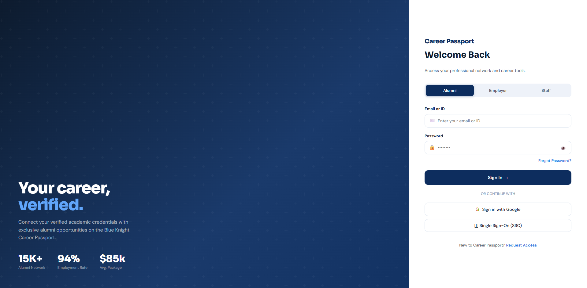

### 02 — Login Screen (Employer Tab)
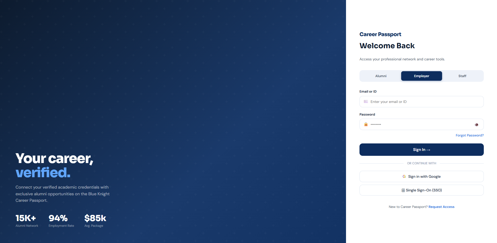

### 03 — Career Passport (Alumni Profile)
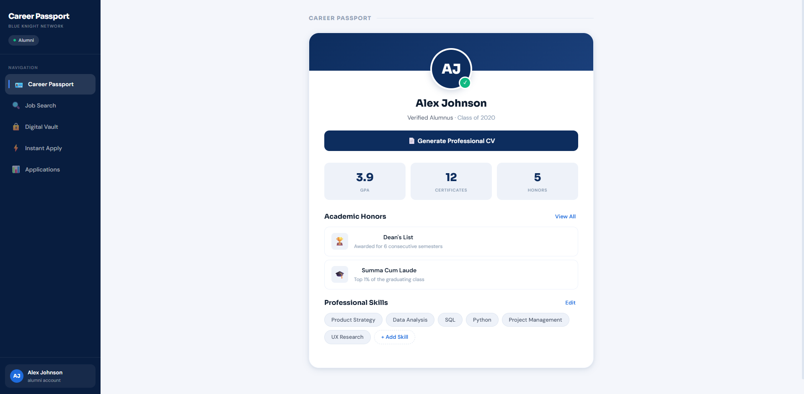

### 04 — Job Search
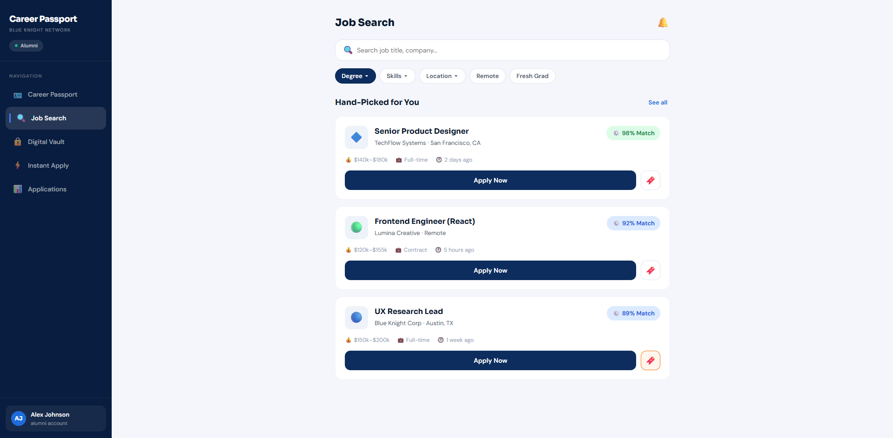

### 05 — Job Detail with Skill Match Analysis
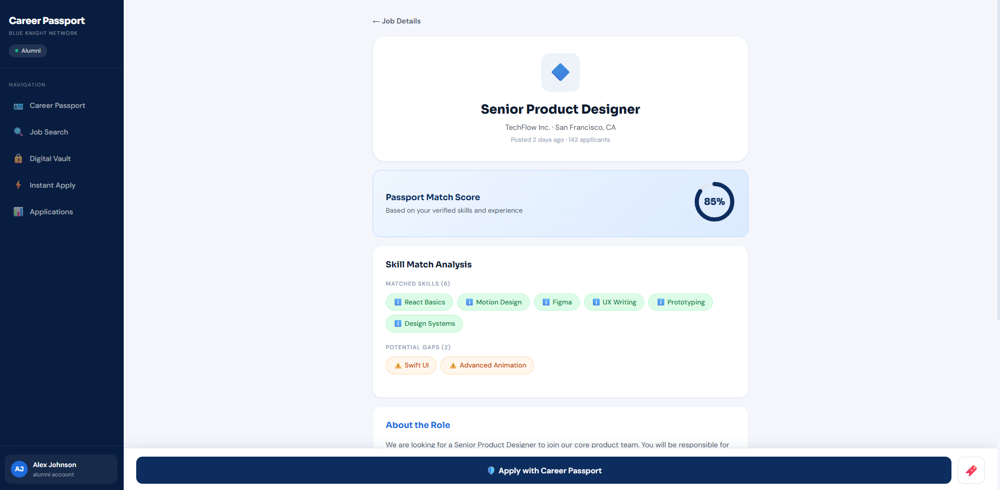

### 06 — Digital Vault
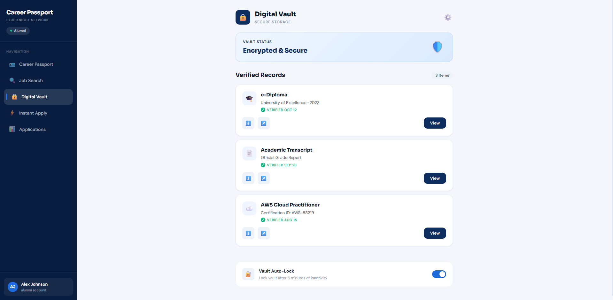

### 07 — Instant Application
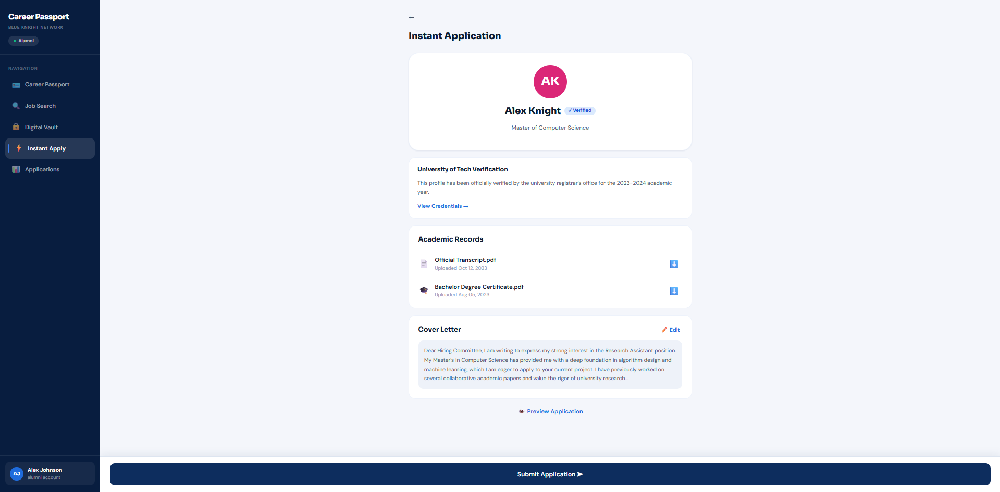

### 08 — Application Status Tracker
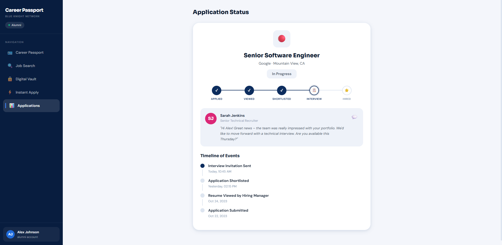

### 09 — Employer Dashboard
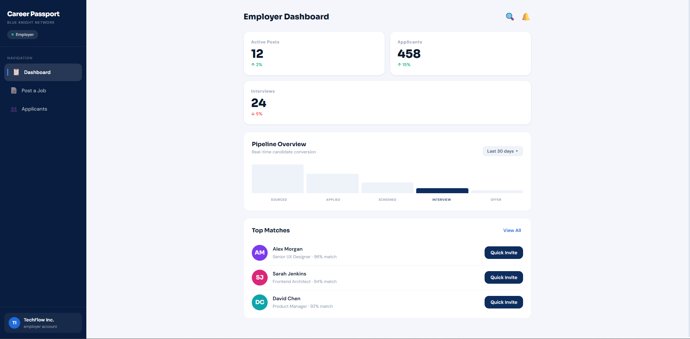

### 10 — Post a Career Opportunity
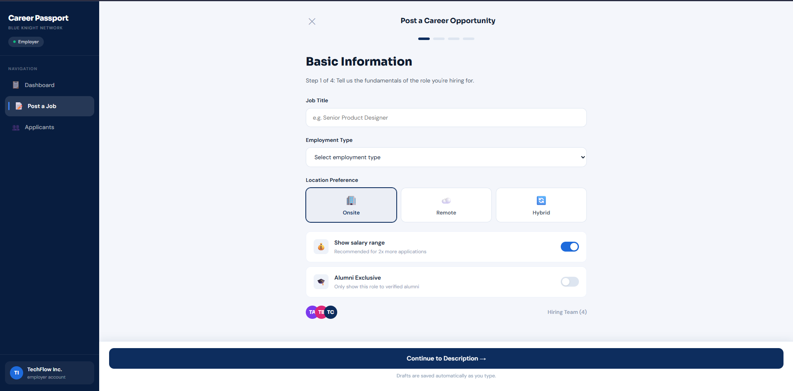

### 11 — Applicant Screening
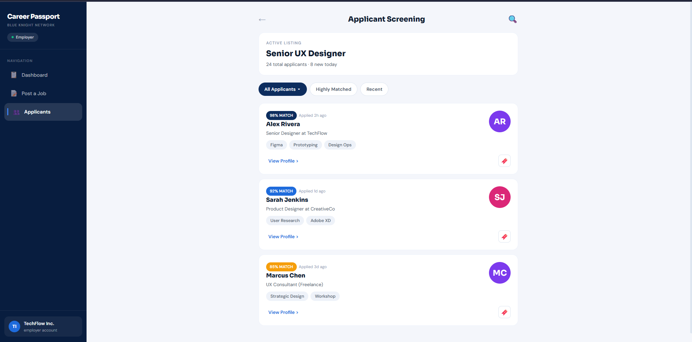

### 12 — Admin Analytics Dashboard
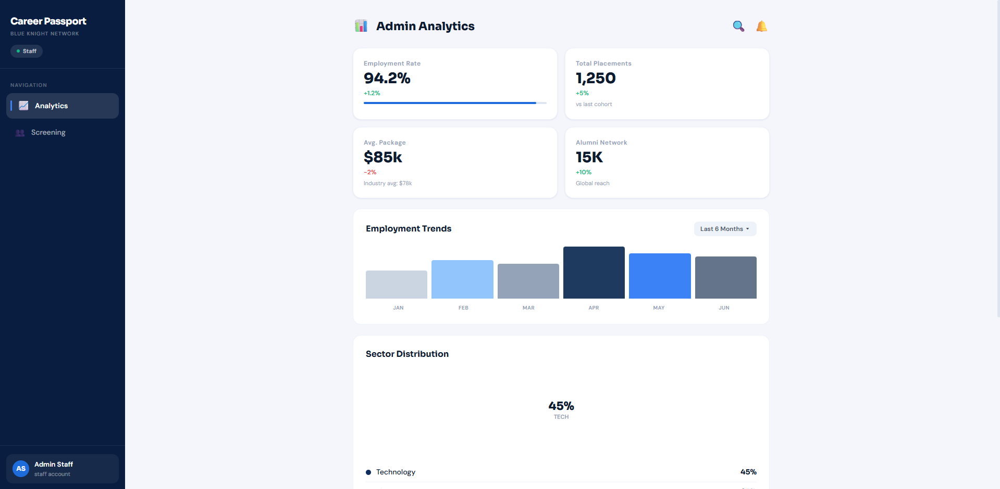

---

## Author

**Maki Yanagida**
Course: 4-112 | MW 7:30AM – 9:00AM
Module 4: Job Posting
